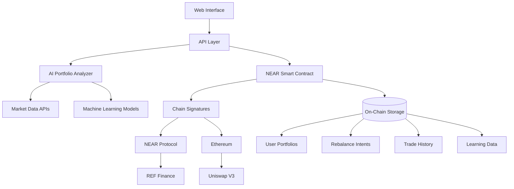

# 🤖 AI-Driven Cross-Chain Portfolio Rebalancer

An intelligent agent that automatically rebalances your crypto portfolio across NEAR and Ethereum using natural language intents and cross-chain signatures.

## 🌟 Overview

This project implements an **AI-powered portfolio management agent** that:

- 📝 **Accepts natural language intents** ("Make my portfolio more conservative", "Increase DeFi exposure", "Balance across chains")
- 🧠 **Uses AI to analyze market conditions** and user preferences
- ⚡ **Executes trades automatically** across NEAR and Ethereum using chain signatures
- 📊 **Learns from user behavior** to improve future recommendations
- 🔗 **Operates cross-chain** without requiring manual bridge transactions

## 🏆 Challenge Submission

This project addresses the **"Agentic Internet and Building AI-led Web3 Experiences"** challenge by:

✅ **AI-driven agent** that processes natural language intents  
✅ **Cross-chain execution** using NEAR chain signatures  
✅ **Autonomous operation** with minimal user intervention  
✅ **On-chain memory** that learns user preferences over time  
✅ **Working demo** deployed to NEAR testnet  

## 🚀 Features

### 🎯 Intent-Based Portfolio Management
- **Natural Language Processing**: Submit intents like "I want a 60% NEAR, 40% ETH portfolio"
- **Risk-Based Strategies**: "Make it conservative", "Go aggressive", "Follow market trends"
- **DeFi Integration**: "Maximize yield", "Focus on DeFi tokens"
- **Cross-Chain Awareness**: "Diversify across chains", "Reduce Ethereum exposure"

### 🔮 AI-Powered Analysis
- **Market Sentiment Analysis**: Real-time market condition assessment
- **Risk Scoring**: Dynamic risk evaluation based on volatility and trends
- **Strategy Optimization**: AI suggests optimal allocation based on user history
- **Confidence Scoring**: Each recommendation comes with confidence levels

### 🌉 Cross-Chain Execution
- **NEAR ↔ Ethereum**: Seamless trading across both ecosystems
- **DEX Integration**: REF Finance (NEAR) and Uniswap (Ethereum)
- **Chain Signatures**: No manual bridging required
- **Gas Optimization**: Smart routing to minimize transaction costs

### 🧠 Learning & Adaptation
- **User Preference Learning**: Tracks successful strategies and user feedback
- **Performance Analytics**: Monitors trade success rates and portfolio performance
- **Strategy Evolution**: Adapts recommendations based on historical data
- **Risk Tolerance Calibration**: Fine-tunes suggestions to user comfort level

## 🏗️ Architecture



## 🛠️ Technology Stack

### Smart Contract (NEAR)
- **Language**: Rust
- **Framework**: NEAR SDK 5.x
- **Features**: Portfolio management, intent processing, cross-chain signatures
- **Storage**: On-chain user preferences, trade history, learning data

### Backend Services
- **Runtime**: Node.js/Next.js
- **AI Engine**: Custom portfolio analyzer with market sentiment analysis
- **Cross-Chain**: Chain signatures for Ethereum transaction execution
- **APIs**: REF Finance, Uniswap, market data providers

### Frontend
- **Framework**: Next.js + React
- **Styling**: Modern CSS with responsive design
- **Wallet**: NEAR Wallet integration
- **Real-time**: Live portfolio updates and trade monitoring

## 📋 Prerequisites

- Node.js 18+ and npm/yarn
- Rust and cargo (for contract development)
- NEAR CLI
- Git

## 🚀 Quick Start

### 1. Clone the Repository
```bash
git clone <repository-url>
cd shade-agent-template
```

### 2. Install Dependencies
```bash
npm install
# or
yarn install
```

### 3. Environment Setup
```bash
cp .env.example .env.local
```

Edit `.env.local` with your configuration:
```env
# NEAR Configuration
NEXT_PUBLIC_contractId=your-contract.testnet
NEXT_PUBLIC_NEAR_RPC_URL=https://rpc.testnet.near.org

# Ethereum Configuration  
NEXT_PUBLIC_ETH_RPC_URL=https://sepolia.infura.io/v3/your-key
NEXT_PUBLIC_ETHEREUM_CHAIN_ID=11155111

# API Keys (optional for enhanced features)
COINGECKO_API_KEY=your-coingecko-key
DEFIPULSE_API_KEY=your-defipulse-key
```

### 4. Deploy the Smart Contract
```bash
cd contract
cargo near build
near deploy your-contract.testnet target/near/shade_agent.wasm
near call your-contract.testnet init '{"owner_id": "your-account.testnet"}' --accountId your-account.testnet
```

### 5. Start the Development Server
```bash
npm run dev
# or
yarn dev
```

Visit `http://localhost:3000` to see the application.

## 📖 Usage Guide

### Setting Up Your Portfolio

1. **Connect Wallet**: Connect your NEAR wallet
2. **Set Preferences**: Configure risk tolerance and preferred chains
3. **Initial Portfolio**: Add your current asset holdings

### Submitting Intents

Use natural language to describe your portfolio goals:

```
"Make my portfolio 60% NEAR and 40% ETH"
"I want to be more conservative, increase stable coins"
"Follow the market trend and adjust accordingly"
"Focus on DeFi tokens with good yield opportunities"
"Rebalance across chains to reduce single-chain risk"
```

### Monitoring Execution

- **Real-time Updates**: Watch trades execute across chains
- **Transaction Links**: Direct links to block explorers
- **Performance Metrics**: Track portfolio value and performance
- **Learning Insights**: See how the AI adapts to your preferences

## 🔧 API Reference

### Smart Contract Methods

#### View Methods
```rust
// Get user's portfolio
get_user_portfolio(user_id: AccountId) -> Vec<PortfolioAsset>

// Get user preferences
get_user_preferences(user_id: AccountId) -> Option<UserPreferences>

// Get rebalance intent
get_intent(intent_id: u64) -> Option<RebalanceIntent>

// Get trade execution
get_trade(trade_id: u64) -> Option<TradeExecution>

// Get market analysis
get_latest_market_analysis() -> Option<MarketAnalysis>

// Get rebalance suggestions
get_rebalance_suggestions(user_id: AccountId) -> Vec<String>
```

#### Change Methods
```rust
// Set portfolio assets
set_portfolio(assets: Vec<PortfolioAsset>)

// Set user preferences
set_user_preferences(preferences: UserPreferences)

// Submit natural language intent
submit_intent(intent_text: String, max_slippage: u32, min_trade_size_usd: u128) -> u64

// Execute rebalance (worker only)
execute_rebalance(intent_id: u64) -> Vec<u64>

// Update trade status (worker only)
update_trade_status(trade_id: u64, status: String, tx_hash: Option<String>, actual_output: Option<u128>)
```

### JavaScript API

#### Portfolio Analyzer
```javascript
import PortfolioAnalyzer from './utils/ai-portfolio-analyzer.js';

const analyzer = new PortfolioAnalyzer();

// Parse natural language intent
const result = await analyzer.parseIntent(
  "Make my portfolio more conservative",
  currentPortfolio,
  userPreferences
);

// Analyze market sentiment
const sentiment = await analyzer.analyzeMarketSentiment();

// Calculate rebalancing needs
const actions = analyzer.calculateRebalanceNeeds(
  currentPortfolio,
  targetPortfolio,
  threshold
);
```

#### Cross-Chain Trader
```javascript
import CrossChainTrader from './utils/cross-chain-trader.js';

const trader = new CrossChainTrader();

// Execute portfolio rebalance
const results = await trader.executeRebalance(trades, userPreferences);

// Get portfolio balances
const balances = await trader.getPortfolioBalances(userAddress);

// Get optimal trade route
const route = await trader.getOptimalRoute(fromAsset, toAsset, amount, fromChain, toChain);
```

## 🧪 Testing

### Unit Tests
```bash
npm test
# or
yarn test
```

### Smart Contract Tests
```bash
cd contract
cargo test
```

### Integration Tests
```bash
npm run test:integration
```

## 📊 Example Scenarios

### Scenario 1: Conservative Rebalancing
**Intent**: "I want to be more conservative with my portfolio"

**AI Analysis**:
- Increases stable coin allocation to 35%
- Reduces volatile asset exposure
- Maintains some growth potential with 30% NEAR, 25% ETH

**Execution**:
- Sells excess NEAR/ETH on respective chains
- Buys USDC on Ethereum and USDT on NEAR
- Updates portfolio automatically

### Scenario 2: DeFi Yield Farming
**Intent**: "Focus on DeFi tokens with good yield opportunities"

**AI Analysis**:
- Allocates 20% to REF token for DEX rewards
- 15% to AURORA for ecosystem growth
- Maintains base allocation in NEAR/ETH
- 15% stable coins for liquidity provision

**Execution**:
- Swaps assets on REF Finance and Uniswap
- Optimizes for yield-generating positions
- Monitors APY changes for future rebalancing

### Scenario 3: Market-Based Strategy
**Intent**: "Follow market trends and adjust accordingly"

**AI Analysis**:
- Analyzes current market sentiment (bullish/bearish/neutral)
- Adjusts risk exposure based on volatility scores
- Increases growth assets in bull markets
- Shifts to stable assets in bear markets

**Execution**:
- Dynamic rebalancing based on market conditions
- Automatic adjustments without user intervention
- Learning from market timing success/failure

## 🔒 Security Considerations

### Smart Contract Security
- **Access Control**: Worker registration with TEE verification
- **Reentrancy Protection**: Safe state updates
- **Input Validation**: Comprehensive parameter checking
- **Upgrade Path**: Controlled contract upgrades

### Cross-Chain Security
- **Chain Signatures**: Secure key derivation and signing
- **Transaction Verification**: Multi-step verification process
- **Slippage Protection**: Maximum slippage limits
- **Gas Limits**: Reasonable gas limit enforcement

### User Security
- **Private Key Management**: Never store private keys
- **Permission Model**: Explicit user consent for trades
- **Audit Trail**: Complete transaction history
- **Emergency Controls**: Pause functionality for emergencies

## 🤝 Contributing

We welcome contributions! Please see our [Contributing Guide](CONTRIBUTING.md) for details.

### Development Workflow
1. Fork the repository
2. Create a feature branch
3. Make your changes
4. Add tests
5. Submit a pull request

### Code Style
- Follow Rust conventions for smart contracts
- Use ESLint/Prettier for JavaScript/TypeScript
- Write comprehensive tests
- Document new features

## 📄 License

This project is licensed under the MIT License - see the [LICENSE](LICENSE) file for details.

## 🙏 Acknowledgments

- **NEAR Protocol** for the amazing chain signatures technology
- **REF Finance** for NEAR DEX integration
- **Uniswap** for Ethereum DEX functionality
- **Shade Protocol** for TEE infrastructure
- **OpenAI** for AI/ML inspiration

## 📞 Support

- **Documentation**: [Full docs](./docs/)
- **Issues**: [GitHub Issues](https://github.com/your-repo/issues)
- **Discord**: [Community Discord](https://discord.gg/your-discord)
- **Email**: support@your-project.com

## 🗺️ Roadmap

### Phase 1: Core Features ✅
- [x] Basic portfolio management
- [x] Natural language intent processing
- [x] Cross-chain execution
- [x] AI-powered analysis

### Phase 2: Enhanced AI 🚧
- [ ] Advanced market sentiment analysis
- [ ] Predictive modeling
- [ ] Risk optimization algorithms
- [ ] Performance attribution analysis

### Phase 3: Multi-Chain Expansion 📋
- [ ] Polygon integration
- [ ] Arbitrum support
- [ ] Avalanche connectivity
- [ ] Cross-chain yield farming

### Phase 4: Advanced Features 📋
- [ ] Options and derivatives
- [ ] Automated yield farming
- [ ] Social trading features
- [ ] Mobile application

---

**Built with ❤️ for the NEAR ecosystem and the future of decentralized finance.**
